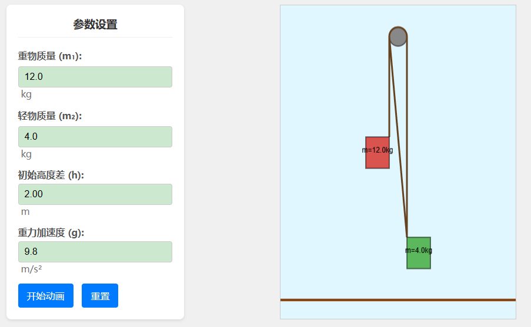
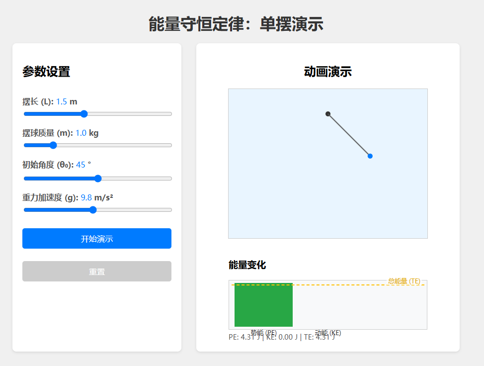
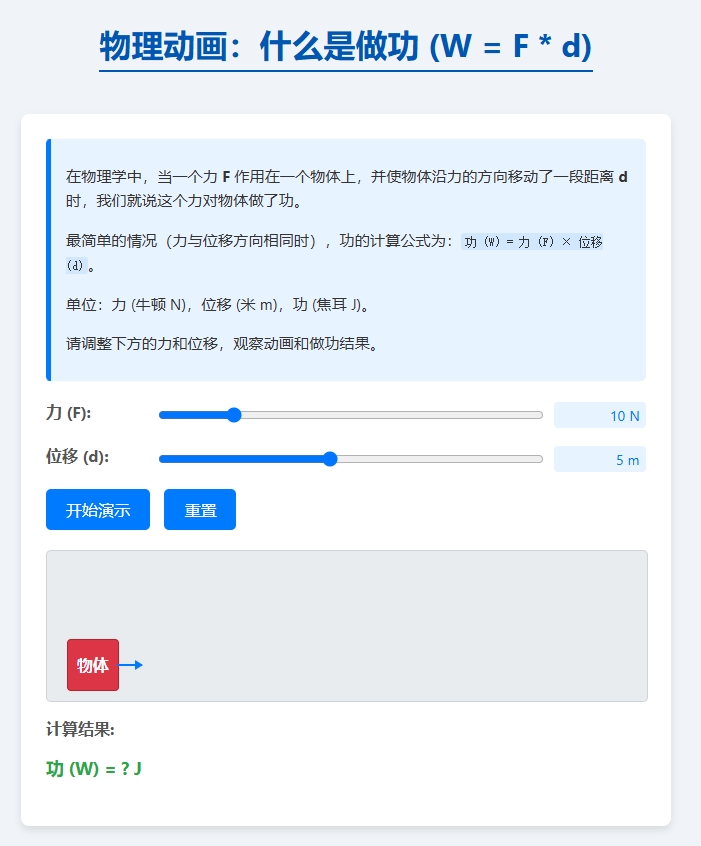

# study11-frontend

利用大模型生成可视化的数理化动画，帮助用户更好地理解复杂的物理、化学和数学概念，支持交互式演示。

---
## ▶️ 线上体验

访问地址：[https://www.study11.ai/](https://www.study11.ai/)
---

## 📂 源码仓库

- **前端（React + TypeScript + Vite）**  
  https://github.com/litongjava/study11-frontend
- **后端（Node.js / Java / Python …）**  
  https://github.com/litongjava/study11-backend

---

## ✨ 功能特性

- **可视化动画**  
  基于大模型（GPT、Gemini 等）生成物理、化学、数学等科目核心概念的动态演示。
- **交互式操作**  
  用户可根据需求调整参数（比如角度、初速度、质量等），实时观察概念变化。
- **多学科覆盖**  
  支持高中阶段的物理、化学、生物、数学原理展示。
- **轻量高效**  
  前端使用 Vite + React + TypeScript，启动速度快，开发体验佳；后端结合大模型 API 与 Manim 渲染，保证动画生成效率。

---

## 🛠 技术栈

- **前端框架**：React + TypeScript  
- **构建工具**：Vite  
- **后端服务**：Node.js / Java /  
- **大模型调用**：OpenAI GPT 系列 / Google Gemini API  

---

## 🚀 本地启动

1. **克隆仓库**  
   ```bash
   git clone https://github.com/litongjava/study11-frontend.git
   git clone https://github.com/litongjava/study11-backend.git
   ```

2. **安装依赖（前端）**  
   ```bash
   cd study11-frontend
   npm install
   # 或者
   yarn
   ```

3. **运行开发环境**  
   ```bash
   npm run dev
   # 或者
   yarn dev
   ```

4. **访问**  
   打开浏览器访问 `http://localhost:5173`

5. **后端配置**  
   - 进入 `study11-backend`，按照 README 配置大模型 API Key、Manim 渲染环境与媒体服务地址  
   - 启动后端服务：  
     ```bash
     npm run start
     # 或者
     mvn spring-boot:run
     ```

---

## 🎬 演示截图

<p align="center">
  
</p>
<p align="center">
  
</p>
<p align="center">
  
</p>
<p align="center">
  
</p>

---

## 🤝 贡献指南

1. Fork 本仓库  
2. 新建分支 `feature/your-feature`  
3. 提交代码并发起 Pull Request  
4. 通过 Review 后合并  

---

## 📄 许可证

本项目采用 [MIT License](./LICENSE) 开源许可，详见 LICENSE 文件。
